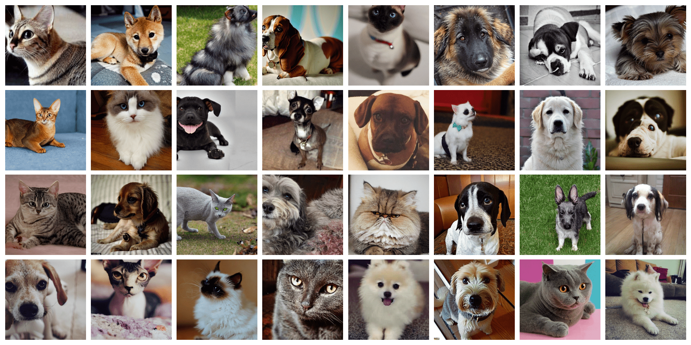
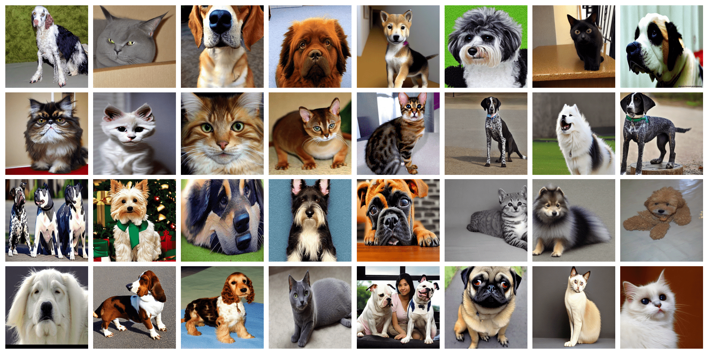
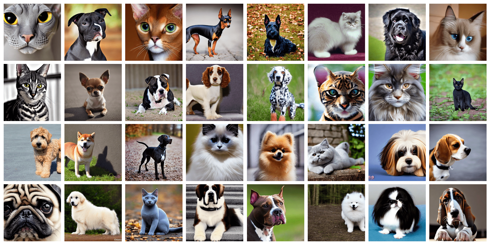
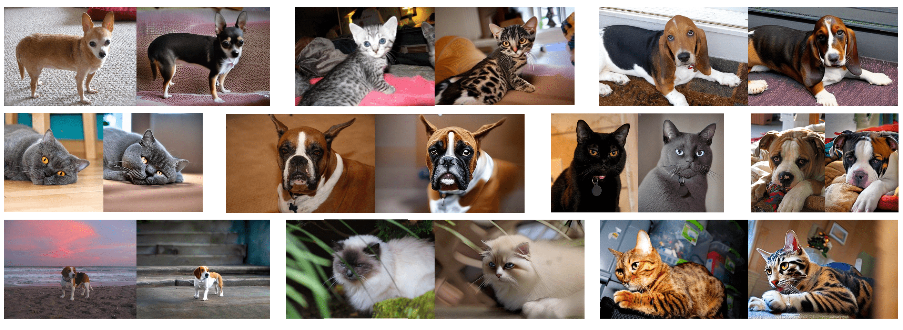
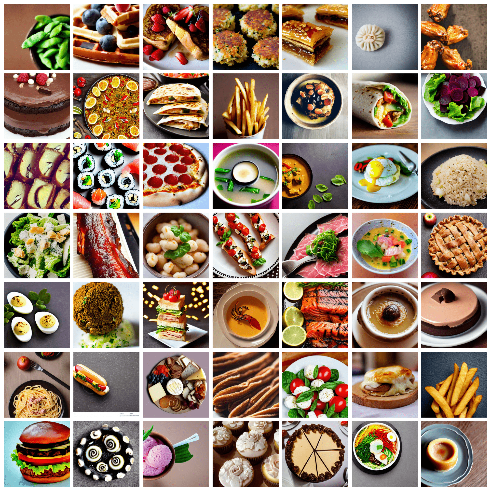

# Subject-Driven Generation Techniques for Stable Diffusion Model 🧠 ⚙️ 🏞️ 

The present repository contains the code developed for the Master's Thesis *Subject-Driven Generation Techniques for Stable Diffusion Model. A Modern Approach to Data Augmentation*. This thesis has been prepared by **Mario Lozano Cortés** over six months at the Department of Applied Mathematics and Computer Science at the **Technical University of Denmark (DTU)** in fulfilment of the requirements for a Master's Thesis on Artificial Intelligence. The thesis was completed as part of the Erasmus mobility programme between the Technical University of Denmark (DTU) and the **Polytechnic University of Catalonia (UPC) - BarcelonaTech**, and it is a requirement for the completion of the Master's degree program in Artificial Intelligence from the *Barcelona School of Informatics* of the Universitat Politècnica de Catalunya (UPC) - BarcelonaTech, the *School of Engineering* of the **Universitat Rovira i Virgili (URV)** and the *Faculty of Mathematics* of the **Universitat de Barcelona (UB)**. 

## 🎯 Abstract

Recent advancements in text-to-image generation models have led to the development of mature systems capable of producing highly realistic and detailed images. These models have become increasingly accessible, empowering researchers to explore novel techniques for enhanced manip- ulation and control. Subject-driven generation emerges as a technique that allows the synthesis of new images featuring a subject within diverse contexts. Hence, to what extent can images generated by text-to-image systems improve the performance of computer vision models? This thesis addresses this question by developing an experimental framework to test the synthetic images generated by the Stable Diffusion model on classification and segmentation tasks. Concretely, we approach the issue through the lens of data augmentation. Our findings show that **subject-driven augmentation is a competitive data augmentation technique, being especially relevant in small datasets where data is scarce or expensive**. Nonetheless, we showcase that **there is still a relevant gap between synthetic and real images**. These findings underscore the potential for *few-shot* and *zero-shot* learning approaches, offering avenues to reduce or eliminate the costs associated with extensive dataset creation while augmenting the capabilities of computer vision models.

## 🧪 Experiments and results

Full details of the experiments conducted, the results and a discussion of the implications can be found in the *report*. The report's location is in the folder report under the name ***thesis_mario_lozano_s226536.pdf***

## 🏞️ Synthetic images sample

This section provides an overview of some  synthetic images generated in the thesis experiments.

**Synthetic images generated using Dreambooth for the Oxford-IIIT Pet domain**

**Synthetic images generated using Textual inversion for the Oxford-IIIT Pet domain**

**Synthetic images generated using Stable Diffusion prompt for the Oxford- IIIT Pet domain**

**Synthetic images generated using ControlNet for the Oxford-IIIT Pet domain**

**Synthetic images generated for the food101 domain**

